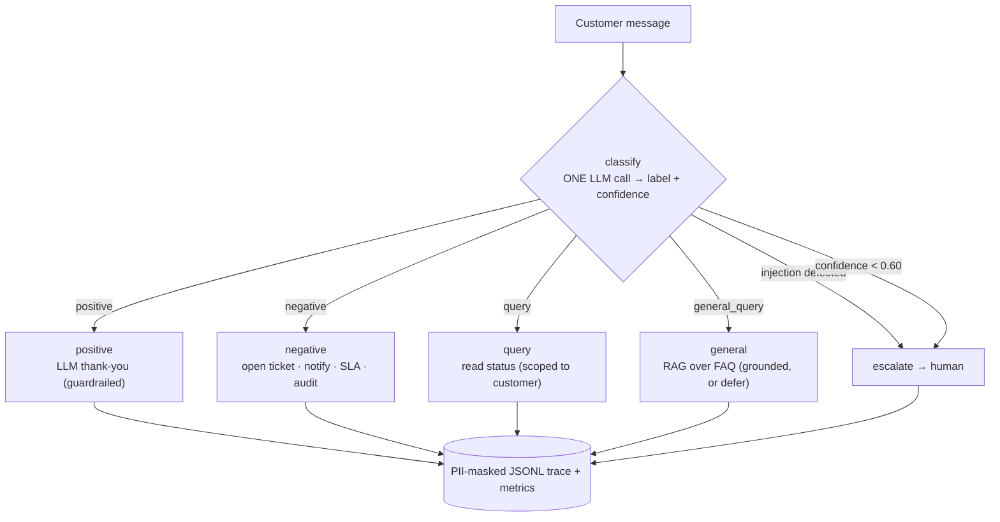

# TriageDesk — Banking Customer Support AI (multi-agent workflow)

[](https://github.com/smiley-icebox/triagedesk/actions/workflows/ci.yml)
&nbsp;[](LICENSE)

A support-triage system that classifies an incoming customer message, then routes it
to the right handler: thank the customer for positive feedback, open a tracked ticket
for a complaint, look up a ticket's status for a query, answer a general banking
question from a knowledge base, or hand off to a human when it isn't sure. Built for
the Applied GenAI capstone, then extended toward a system you'd actually run.


## The one idea worth taking away

This is a **workflow, not an agent swarm** — and that's the right call for a banking
transaction flow, not a compromise.

- The LLM does the **fuzzy-language** work only it can do: classifying a message
  (with a confidence score) and drafting empathetic copy within guardrails.
- **Everything factual or transactional is deterministic code**: ticket creation,
  status lookups, status transitions, the customer's identity. The LLM never reports
  a ticket status, invents a ticket number, or states a fact from outside the data.
- **Routing is done by code, not the model.** The classifier writes a label to state;
  a plain function (`route_by_label`) picks the next node. Deterministic, auditable,
  unit-testable without an API call.

Compare this to the **agent** pattern: a typical LangGraph agent binds tools and lets
the LLM decide which to call inside a loop (`tools_condition`). Right for open-ended
Q&A; wrong here — you don't want a model improvising over customer account data.

## Architecture

One LLM call classifies; **code** deterministically routes to one of five agent nodes.
The LLM is fenced out of the data path entirely.



`route_by_label` is a plain function reading a structured label — deterministic,
auditable, and unit-testable without an API call. Below-threshold confidence or a
detected injection routes to **escalate** (a human) rather than being forced down a
happy path; if the API is unreachable, classification degrades to a keyword fallback.

## Module map (by layer)

Flat on disk (it's a small app); cleanly layered by responsibility:

| Layer | Modules |
|------|---------|
| **Foundation** | `config.py` (model, thresholds, labels, templates, prompt), `llm.py` (Claude client factory + helpers) |
| **Agents / routing** | `classifier.py`, `graph.py`, `handlers.py`, `responder.py`, `knowledge.py` |
| **Storage** | `repository.py` (interface + SQLite impl), `migrations.py`, `db.py` (facade) |
| **Services** | `auth.py`, `notifier.py`, `observability.py` |
| **Eval / data** | `evaluation.py`, `seed_data.py` |
| **UI** | `app.py` (Streamlit) |

## Data model

Two tables (`migrations.py`); the audit trail is the production-minded part:

- **`support_tickets`** — `ticket_id` (6-digit PK), `customer_id` (owner; scopes all
  reads), `customer_name`, `issue`, `status` (enum), `priority`, `created_at`,
  `updated_at`, `sla_due_at`, `sla_breached`.
- **`ticket_events`** — an **immutable audit row per change** (`created` / `status_change`)
  with `from_status` → `to_status`, `actor`, `note`, `created_at`. Written in the *same
  transaction* as the ticket change, so the history can never drift from the data.

## What's "real" here (beyond the brief)

- **Auth (`auth.py`)** — identity comes from a verified login (PBKDF2 hashes, constant-
  time compare), not a UI text box. Lookups scope to the authenticated `customer_id`,
  closing the IDOR hole.
- **Storage seam (`repository.py` + `migrations.py`)** — all DB access is behind a
  `TicketRepository` interface with versioned migrations. SQLite today; a Postgres
  backend is a drop-in at the factory. Ticket creation is race-free (insert-retry, not
  check-then-insert).
- **Lifecycle + audit** — tickets move Open → In Progress → Resolved, and every change
  writes an immutable `ticket_events` row. **SLA** deadlines per priority, with a breach
  check.
- **Classifier hardening (`classifier.py`)** — retry/timeout, a deterministic keyword
  **fallback** when the API is down, and an **injection guardrail**.
- **LLM responses within guardrails (`responder.py`)** — warmth is LLM-drafted; the
  ticket number is code-supplied and verified to appear, or it falls back to a template.
- **RAG (`knowledge.py`)** — general questions are answered from a small FAQ via
  retrieve → grounded generate, and it **defers to a human** rather than guessing.
- **Multi-turn** — follow-ups ("any update?") resolve a ticket id from earlier in the chat.
- **Observability (`observability.py`)** — PII-redacted structured traces, aggregate
  metrics (route/source/escalation-rate/p95), opt-in LangSmith.
- **Notifications (`notifier.py`)** — ticket-created messages via a swappable notifier.

## Files

| File | What it is |
|------|------------|
| `config.py` | Model, thresholds, labels/statuses, templates, the classifier prompt, SLA, flags. |
| `auth.py` | Login + sessions (hashed passwords). Identity, derived not asserted. |
| `classifier.py` | The one LLM call: structured `{label, confidence}` + guardrail + fallback. |
| `responder.py` | LLM-drafted empathetic replies, guardrailed, template fallback. |
| `knowledge.py` | RAG: FAQ retrieval + grounded answering for general questions. |
| `repository.py` | `TicketRepository` interface + SQLite impl (Postgres-ready). |
| `migrations.py` | Versioned, forward-only schema migrations. |
| `db.py` | Thin facade over the repository (stable function API). |
| `handlers.py` | The five deterministic response paths. No LLM facts below this line. |
| `graph.py` | LangGraph wiring: `classify → route_by_label → handler → END` + `respond()`. |
| `notifier.py` | Outbound notifications behind a swappable interface. |
| `observability.py` | PII-redacted traces, metrics, LangSmith status. |
| `evaluation.py` | Classification metrics + LLM-as-judge empathy/clarity scoring. |
| `seed_data.py` | Sample tickets + the labeled evaluation set. |
| `app.py` | Streamlit dashboard: login, triage (+ auto-scroll), tickets/lifecycle, debug. |
| `tests/` | 99 tests — DB, handlers, routing, auth, lifecycle, responder, RAG, eval, integration — no API key needed. |

## Run it

```bash
python3 -m venv .venv
.venv/bin/pip install -r requirements.txt

cp .env.example .env        # then put your real key in it: ANTHROPIC_API_KEY=sk-ant-...

.venv/bin/python seed_data.py     # build the demo database
.venv/bin/streamlit run app.py    # launch the dashboard
```

Sign in (all password `demo123`): **jordan** / **sam** (customers — jordan owns the
sample tickets; query ticket 940011 as jordan to see read-scoping), or **agent** (a
support agent who sees all tickets and can drive their lifecycle). Use the sidebar
scenario buttons to exercise each route, including the RAG general-question path.

**No Anthropic key?** Set `USE_LLM_RESPONSES=0` in `.env` and you can still run the
whole UI — replies fall back to approved templates and RAG answers extractively from
the FAQ, with no live LLM call. (Live triage classification still needs a key.)

## Verify

```bash
.venv/bin/python -m pytest          # 99 tests, no API key needed
.venv/bin/python evaluation.py      # live: classification metrics + LLM-as-judge quality
```

## Still documented, not built

A few things remain honestly out of scope (see `WRITEUP.md`): a real identity provider
behind `auth.py`, the actual Postgres implementation behind the repository seam, real
email/SMS adapters behind the notifier, and embeddings + a vector store behind the RAG
retriever. Each has its seam in place, so it's a drop-in, not a rewrite.
